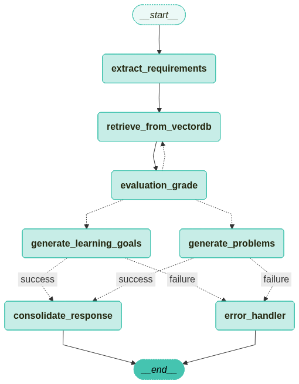

# EduGen

## 1. 프로젝트 개요

EduGen은 사용자의 프롬프트를 기반으로 맞춤형 교육 콘텐츠를 자동으로 생성하는 에이전트입니다. 학습 목표, 연습 문제 등 다양한 교육 자료를 신속하게 제작하여 교육자와 학습자를 지원하는 것을 목표로 합니다.

## 2. 핵심 기능

- **프롬프트 기반 콘텐츠 생성**: 사용자가 입력한 요구사항(학교급, 학년, 과목, 주제 등)을 분석하여 콘텐츠를 생성합니다.
- **다양한 콘텐츠 유형 지원**: 현재 '학습 목표'와 '연습 문제' 생성을 지원합니다.
- **벡터 DB 활용**: 관련성 높은 정보를 벡터 데이터베이스에서 검색하여 콘텐츠 생성의 기반 자료로 활용합니다.
- **병렬 처리**: 학습 목표와 문제 생성을 동시에 처리하여 응답 시간을 단축합니다.

## 3. 동작 원리

EduGen은 LangChain의 GraphState를 기반으로 각 기능이 모듈화된 노드(Node)와 그 흐름을 제어하는 엣지(Edge)로 구성됩니다.

1.  **요구사항 추출 (`extract_requirements`)**: 사용자의 프롬프트를 분석하여 `States.py`에 정의된 `Requirements` 모델에 따라 학교급, 학년, 과목, 요청 유형 등의 메타데이터를 추출합니다.
2.  **벡터 DB 검색 (`retrieve_from_vectordb`)**: 추출된 메타데이터를 기반으로 벡터 데이터베이스에서 관련 문서를 검색합니다.
3.  **검색 결과 평가 (`evaluation_grade`)**: 검색된 문서가 사용자의 요구사항과 관련이 있는지 LLM을 통해 평가합니다. 관련성이 낮다고 판단되면, `retrieve_from_vectordb` 노드로 돌아가 검색을 다시 수행합니다.
4.  **콘텐츠 병렬 생성 (`generate_learning_goals`, `generate_problems`)**: 관련성이 충분한 문서를 찾으면, 해당 문서를 바탕으로 '학습 목표'와 '연습 문제'를 병렬로 생성하여 효율성을 높입니다.
5.  **오류 처리 (`error_handler`)**: 콘텐츠 생성 과정에서 오류가 발생하면, 오류 처리 노드로 이동하여 그래프 실행을 안전하게 종료합니다.
6.  **최종 응답 종합 (`consolidate_response`)**: 생성된 학습 목표와 연습 문제가 모두 성공적으로 준비되면, 이 결과들을 취합하여 사용자에게 제공할 최종 응답을 구성합니다.

## 4. 주요 파일 구성

- **`Nodes.py`**: 그래프의 각 처리 단계를 담당하는 노드들의 로직을 정의합니다. (예: 요구사항 추출, DB 검색, 콘텐츠 생성)
- **`States.py`**: 그래프의 각 노드 간에 전달되는 데이터의 상태와 구조를 Pydantic 모델과 TypedDict로 정의합니다.
- **`Edges.py`**: 노드 간의 조건부 분기 등 제어 흐름과 로직을 정의합니다.
- **`app.py`**: Streamlit을 사용하여 사용자가 상호작용할 수 있는 UI를 구현합니다.
- **`Compile_graph.py`**: 정의된 노드와 엣지를 연결하여 실행 가능한 LangGraph 에이전트를 컴파일합니다.

## 5. 기술 스택

- **LLM**: Google `gemini-2.5-flash` (Free Tier)
- **Embedding Model**: BAAI `bge-m3`
- **주요 라이브러리**: LangChain, Pydantic, Sentence-Transformers, Streamlit
- **데이터베이스**: PostgreSQL (pgvector 확장 기능 사용)
